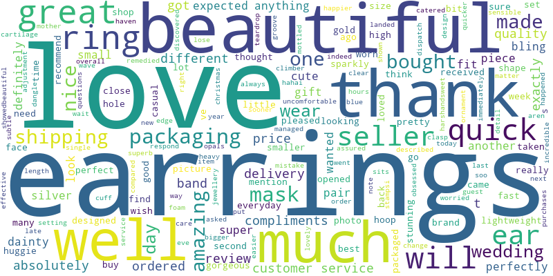
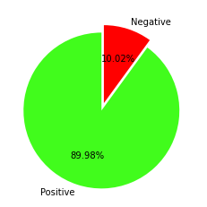

# Sentiment-Analysis-NLP-project
- This a intermediate ML project using Regression algorithm which detect whether the reviews are positive or negative

- This Repo is based on Machine Learning and Deep Learning , It is a NLP project.

- This Project is used to analyze the customer's reviews of different products from a E-commerce Website called Etsy whether it is a Positive or Negative review.

 

  

